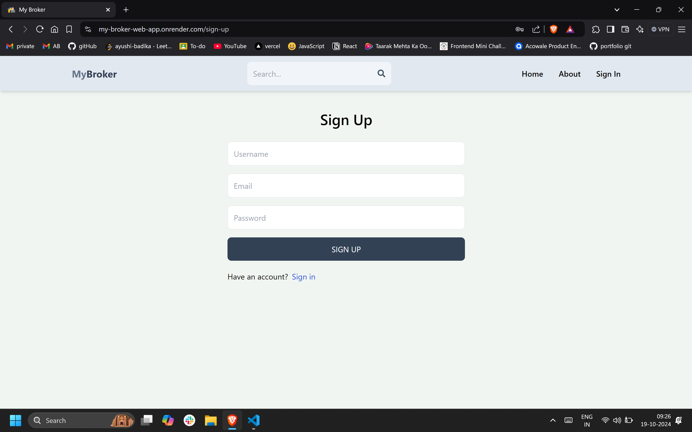
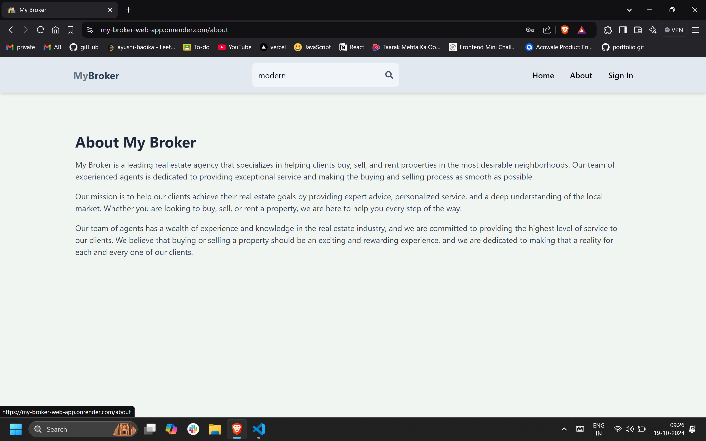

# My Broker

My Broker is a leading real estate agency web application that specializes in helping clients buy, sell, and rent properties in the most desirable neighborhoods. Our platform provides a seamless experience for both real estate agents and clients, making the property transaction process as smooth as possible.

## Hosted Link : https://my-broker-web-app.onrender.com/

## Table of Contents

- [Features](#features)
- [Screenshots](#screenshots)
- [Installation](#installation)
- [Usage](#usage)
- [API Routes](#api-routes)
- [Contributing](#contributing)
- [License](#license)

## Features

- User authentication (sign up, sign in, sign out)
- Property listing creation and management
- Search and filter properties
- User profile management
- Responsive design for mobile and desktop

## Screenshots

Here are screenshots of the key pages in our application:

### Home Page


### Sign In Page


### Sign Up Page



### About Page



### Listings Page


### Create Listing Page


### Edit Listing Page


### Profile Page


### Your Listing Page


### Search Result Page


## Installation

1. Clone the repository:

   ```
   git clone https://github.com/AyushiBadika/Broker-Web-App.git
   ```

2. Install dependencies:

   ```
   npm install
   ```

3. Set up your environment variables:

   ```
   In root directory :
   PORT
   CONNECTION_STRING
   JWT_SECRET

   cd client :
   VITE_FIREBASE_API_KEY

   ```

   Then edit the `.env` file with your configuration.

## Usage

To run the project in development mode:

```
npm run dev
```

To build the project:

```
npm run build
```

### Auth Routes

- **POST** `/auth/sign-up`: Register a new user
- **POST** `/auth/sign-in`: Log in a user
- **GET** `/auth/sign-out`: Log out the user

### Listing Routes

- **POST** `/listing/create`: Create a new listing (requires token)
- **GET** `/listing/listings`: Get all listings of a user (requires token)
- **DELETE** `/listing/delete/:id`: Delete a listing by ID (requires token)
- **POST** `/listing/update/:id`: Update a listing by ID (requires token)
- **GET** `/listing/get/:id`: Get a specific listing by ID
- **GET** `/listing/get/`: Get all listings

### User Routes

- **GET** `/user/:id`: Get user data by ID (requires token)
- **POST** `/user/update`: Update user data (requires token)
- **DELETE** `/user/delete`: Delete a user account (requires token)

## Contributing

We welcome contributions to My Broker! If you have suggestions or improvements, please follow these steps:

1. Fork the repository
2. Create your feature branch (`git checkout -b feature/AmazingFeature`)
3. Commit your changes (`git commit -m 'Add some AmazingFeature'`)
4. Push to the branch (`git push origin feature/AmazingFeature`)
5. Open a Pull Request

## License

This project is licensed under the [MIT License](https://choosealicense.com/licenses/mit/).
